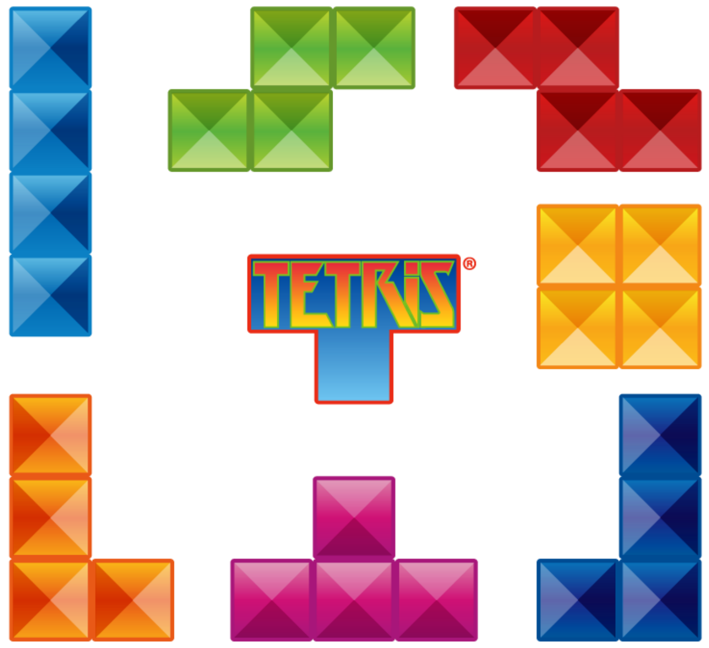
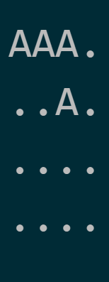

## fillit
Fillit is a [42-network](https://www.codam.nl/en/the-42-network) project which involves discovering and getting acquainted with a recurrent problem in programming: the search of an optimal solution among a very large number of possibilities in a reasonable amount of time. The purpose of this project is to take a file containing a list of tetriminos to sort them in the smallest square possible.
The program takes a file containing a list of Tetriminos as parameter and prints the square with tetriminos to the standard output.

## Compiling
Run ```make```, an executable called ```fillit``` should compile directly. Please submit an issue if you run into any.

## Tetriminos
</img>

A Tetrimino is a 4-blocks geometric figure you probably already heard of, thanks to the popular game Tetris. The map ```tetriminos``` contains three example files with Tetriminos. The Tetriminos are represented like this:
```
cat tetriminos/list1
###.
..#.
....
....

....
.###
..#.
....

....
....
####
....

```

## How to use?
After creating the executable file, ```fillit``` can be executed by giving it a Tetrimino-file as parameter e.g.:

```./fillit tetriminos/list1```

In this case, the output looks like shown below. Note that to differentiate the Tetriminos, all of them are assigned a uppercase letter starting with 'A'.

```
.AAA
BBBA
.B..
CCCC
```

## Specifications
Apart from finding the smallest possible square to fit all Tetriminos, another requirement is that the algorithm must place all Tetriminos as far as possible in the top-left corner. Tetriminos at the beginning of the given list have precedence over the Tetriminos that come later in the list.

Fillit is a project that introduces the concepts of **recursion** and **time complexity**, which are important concepts in computer science. The method used in this project is a **Brute Force Algorithm** with some optimization techniques. Bruteforcing basically means trying all possible configurations of Tetriminos until a solution is found. A great benefit of this method is that if there are one or more solutions, it will always find the best solution. A major drawback is that calculation time increases drastically as the amount of given Tetriminos increases.

The gif below shows an example of how the algorithm finds a solution using recursion:
</img>
